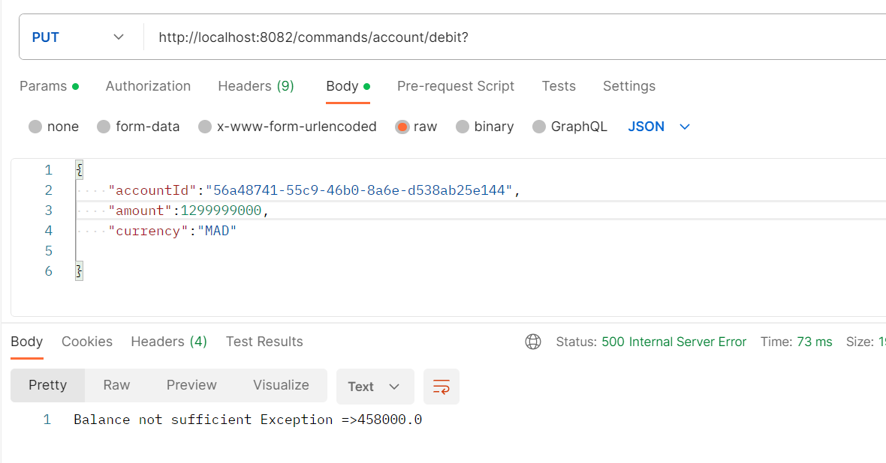
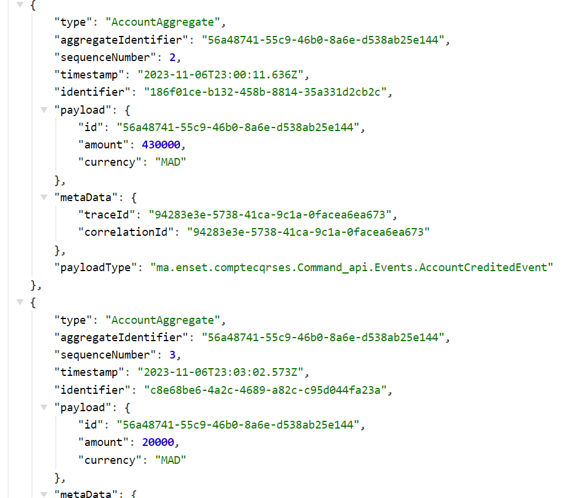

# Event Driven Distributed Architecture
Setting up an application that manages accounts following the CQRS (Command Query Responsibility Segregation) and Event Sourcing patterns using the Axon Framework and Spring Boot can be a complex project, but it offers many benefits in terms of scalability, event traceability, and data consistency.

<b>Work to do : </b>


## Plan

- <a href="#section1">application.properties </a>
- <a href="#2">pom.xml</a>
- <a href="#3">Command Api</a>
- <a href="#4">Commands</a>
- <a href="#5">Query</a>
- <a href="#6">CompteCqrsEsApplication</a>
- <a href="#7">Execution</a>

<h2 id="section1"> application.properties</h2>
It contains configuration properties related to the application's name, database connection, Hibernate settings, and the server's port.

```
spring.application.name =compte-service
spring.datasource.url = jdbc:mysql://${MYSQL_HOST:localhost}:${MYSQL_PORT:3306}/bank?createDatabaseIfNotExist=true
spring.datasource.username = ${MYSQL_USER:root}
spring.datasource.password = ${MYSQL_PASSWORD:}
spring.jpa.hibernate.ddl-auto = update
spring.jpa.properties.hibernate.dialect = org.hibernate.dialect.MariaDBDialect
server.port=8082
```

<h2 id="2">pom.xml</h2>
the POM file configures a Spring Boot application with dependencies for data access, web, testing, and CQRS/event sourcing using the Axon Framework. It specifies that the application is using Java 17 as the Java version.

```
<modelVersion>4.0.0</modelVersion>
    <parent>
        <groupId>org.springframework.boot</groupId>
        <artifactId>spring-boot-starter-parent</artifactId>
        <version>3.1.5</version>
        <relativePath/> <!-- lookup parent from repository -->
    </parent>
    <groupId>ma.enset</groupId>
    <artifactId>Compte-cqrs-es</artifactId>
    <version>0.0.1-SNAPSHOT</version>
    <name>Compte-cqrs-es</name>
    <description>Compte-cqrs-es</description>
    <properties>
        <java.version>17</java.version>
    </properties>
    <dependencies>
        <dependency>
            <groupId>org.springframework.boot</groupId>
            <artifactId>spring-boot-starter-data-jpa</artifactId>
        </dependency>
        <dependency>
            <groupId>org.springframework.boot</groupId>
            <artifactId>spring-boot-starter-web</artifactId>
        </dependency>

        <dependency>
            <groupId>com.mysql</groupId>
            <artifactId>mysql-connector-j</artifactId>
            <scope>runtime</scope>
        </dependency>
        <dependency>
            <groupId>org.projectlombok</groupId>
            <artifactId>lombok</artifactId>
            <optional>true</optional>
        </dependency>
        <dependency>
            <groupId>org.springframework.boot</groupId>
            <artifactId>spring-boot-starter-test</artifactId>
            <scope>test</scope>
        </dependency>
        <dependency>
            <groupId>org.springdoc</groupId>
            <artifactId>springdoc-openapi-starter-webmvc-ui</artifactId>
            <version>2.2.0</version>
        </dependency>
        <!-- https://mvnrepository.com/artifact/org.axonframework/axon-spring-boot-starter -->
        <dependency>
            <groupId>org.axonframework</groupId>
            <artifactId>axon-spring-boot-starter</artifactId>
            <version>4.7.4</version>
            <exclusions>
                <exclusion>
                    <groupId>org.axonframework</groupId>
                    <artifactId>axon-server-connector</artifactId>
                </exclusion>
            </exclusions>
        </dependency>


    </dependencies>
```

<h2 id="3">Command Api</h2>

### Commands 
<ul>
<li><b>BaseCommand:</b></li>This class is using the Lombok library's @Getter annotation to generate a getter method for the id field, and the @TargetAggregateIdentifier annotation from the Axon Framework. By using these annotations and this base class, you can create specific command classes that inherit from BaseCommand and use the @TargetAggregateIdentifier annotation on their identifier field, which is a common pattern in Axon-based CQRS (Command-Query Responsibility Segregation) applications.

```
import lombok.Getter;
import org.axonframework.modelling.command.TargetAggregateIdentifier;

public abstract class BaseCommand<T> {
    @TargetAggregateIdentifier
    @Getter
    private T id;

    public BaseCommand(T id) {
        this.id = id;
    }
}
```

<li><b>CreatAccountCommand:</b> 'CreateAccountCommand' that extends the BaseCommand &lt String &gt. This class represents a command for creating an account and has additional fields for 'initialBalance' and 'currency'

```
import lombok.Getter;

public class CreatAccountCommand extends BaseCommand<String>{
    @Getter
    private double initialBalance;
     @Getter private String currency;

    public CreatAccountCommand(String id, double initialBalance, String currency) {
        super(id);
        this.initialBalance = initialBalance;
        this.currency = currency;
    }
}
```
</li>
<li><b>CreditAccountCommand:</b>This class represents a command for crediting an account with a certain amount in a specific currency. This class appears to be a command used to credit a specific account with a given amount in a specific currency. It fits the CQRS pattern where commands are used to perform actions on the system, in this case, updating an account's balance.

```
import lombok.Getter;
public class CreditAccountCommand extends BaseCommand<String>{
    @Getter private double amount;
    @Getter private String currency;

    public CreditAccountCommand(String id, double amount, String currency) {
        super(id);
        this.amount = amount;
        this.currency = currency;
    }
}
```

</li>
<li><b>DebitAccountCommand:</b> This class represents a command for debiting an account with a certain amount in a specific currency. This class appears to be a command used to debit a specific account with a given amount in a specific currency, which also fits the CQRS pattern where commands are used to perform actions on the system.

```
import lombok.Getter;
public class DebitAccountCommand extends BaseCommand<String>{
    @Getter private double amount;
    @Getter private String currency;

    public DebitAccountCommand(String id, double amount, String currency) {
        super(id);
        this.amount = amount;
        this.currency = currency;
    }
}
```
</li>
</ul>

### DTOS
<ul><li><b>CreateAccountRequestDTO: </b>The class 'CreateAccountRequestDTO' appears to be a Data Transfer Object (DTO) used for creating an account. This class uses Lombok annotations to automatically generate common boilerplate code for a data class.

```
import lombok.AllArgsConstructor;
import lombok.Data;
import lombok.NoArgsConstructor;

@Data @NoArgsConstructor @AllArgsConstructor
public class CreateAccountRequestDTO {
    private double initialBalance;
    private String currency;

}
```

</li>
<li><b>CreditAccountRequestDTO:</b> The 'CreditAccountRequestDTO' class is another Data Transfer Object (DTO), similar to the previous one, used for representing data related to crediting an account. This class uses the Lombok @Data annotation, which automatically generates getter and setter methods, 'equals', 'hashCode', and 'toString' methods for the class. This class is designed for transferring data related to crediting an account, such as when a client sends a request to credit a specific account with a given amount in a specific currency. The use of Lombok annotations simplifies the code by automatically generating the necessary methods, reducing the amount of boilerplate code you need to write.

```
import lombok.Data;
@Data
public class CreditAccountRequestDTO {
    private String accountId;
    private double amount;
    private String currency;
}
```
</li>
<li><b>DebitAccountRequestDTO:</b> The DebitAccountRequestDTO class is another Data Transfer Object (DTO), similar to the previous ones you've shared. It is used for representing data related to debiting an account. Like the others, this class uses the Lombok @Data annotation to automatically generate getter and setter methods, equals, hashCode, and toString methods for the class.

```
import lombok.Data;
@Data
public class DebitAccountRequestDTO {
    private String accountId;
    private double amount;
    private String currency;
}

```
</li></ul>

### Events
<ul>
<li><b>BaseEvent: </b>The 'BaseEvent' class is an abstract class that serves as a base class for defining events in your system. It takes a type parameter 'T', which represents the type of identifier associated with the event.

```
import lombok.Getter;
public abstract class BaseEvent<T> {
    @Getter private T id;

    public BaseEvent(T id) {
        this.id = id;
    }
}
```
</li>
<li><b>AccountCreatedEvent: </b>The 'AccountCreatedEvent' class appears to represent an event that is raised when an account is created. This event extends BaseEvent &lt String &gt, which indicates that it carries information related to a specific aggregate with a 'String' identifier. This event is typically used in an event-driven architecture or in the context of Domain-Driven Design (DDD) to capture and broadcast information about the creation of an account. By using this event, you can notify other parts of your system or external systems that an account has been created and provide details about the account, such as its initial balance, currency, and status.

```
public class AccountCreatedEvent extends BaseEvent<String>{
    @Getter private double initialBalance;
    @Getter private String currency;
    @Getter private AccountStatus status;

    public AccountCreatedEvent(String id, double initialBalance, String currency, AccountStatus status) {
        super(id);
        this.initialBalance = initialBalance;
        this.currency = currency;
        this.status = status;
    }
}
```

</li>
<li><b>AccountActivatedEvent: </b>The 'AccountActivatedEvent' class represents an event that is raised when an account is activated. It extends 'BaseEvent &lt String &gt ', indicating that it is associated with a specific aggregate identified by a 'String' value. This event is used to notify other parts of the system or external systems that an account has been activated and provide details about the account's new status. It's a common pattern in event-driven architectures, especially in the context of Domain-Driven Design (DDD), where events are used to capture and broadcast changes in the system's state.

```
import lombok.Getter;
import ma.enset.comptecqrses.Command_api.enums.AccountStatus;

public class AccountActivatedEvent extends BaseEvent<String>{
    @Getter private AccountStatus status;

    public AccountActivatedEvent(String id,AccountStatus status) {
        super(id);
        this.status = status;

    }
}
```

</li>
<li><b>AccountCreditedEvent: </b> The 'AccountCreditedEvent' class represents an event that is raised when an account is credited with a certain amount in a specific currency. It extends 'BaseEvent &lt String &gt', indicating that it is associated with a specific aggregate identified by a 'String' value. This event is used to notify other parts of the system or external systems that an account has been credited with a specific amount in a specific currency. It's a common pattern in event-driven architectures to capture and broadcast changes to the system's state.

```
import lombok.Getter;
public class AccountCreditedEvent extends BaseEvent<String>{
    @Getter private double amount;
    @Getter private String currency;


    public AccountCreditedEvent(String id, double amount, String currency) {
        super(id);
        this.amount = amount;
        this.currency = currency;
    }
}
```
</li>
<li><b>AccountDebitedEvent: </b>The AccountDebitedEvent class represents an event that is raised when an account is debited with a certain amount in a specific currency. It extends 'BaseEvent &lt String &gt', indicating that it is associated with a specific aggregate identified by a 'String' value. 

```
import lombok.Getter;
public class AccountDebitedEvent extends BaseEvent<String>{
    @Getter private double amount;
    @Getter private String currency;


    public AccountDebitedEvent(String id, double amount, String currency) {
        super(id);
        this.amount = amount;
        this.currency = currency;
    }
}
```
</li>
</ul>

### Queries 

<ul><li><b>GetAccountByIdQuery:</b>The 'GetAccountByIdQuery' class appears to be a data class used for querying account information by its identifier. This class is commonly used in applications with a CQRS (Command-Query Responsibility Segregation) architecture, where queries are used to retrieve data without modifying the state of the system. In this case, 'GetAccountByIdQuery' allows you to request account information by specifying the account's identifier as a query parameter.

```
import lombok.AllArgsConstructor;
import lombok.Data;
import lombok.NoArgsConstructor;
@Data
@NoArgsConstructor @AllArgsConstructor
public class GetAccountByIdQuery {
    private String id;

}
```
</li></ul>

### Enums 

<ul><li><b>AccountStatus: </b>The 'AccountStatus' enum represents the possible states or statuses that an account can have.

```
public enum AccountStatus {
    CREATED, ACTIVATED, SUSPENDED
}

```
</li>
<li><b>OperationType: </b>The OperationType enum represents the two possible types of financial operations that can occur in your system.

```
public enum OperationType {
    CREDIT, DEBIT
}
```

</li></ul>

### Exceptions

<ul><li><b>AmountNegativeExceprion: </b>The 'AmountNegativeException' class appears to be a custom exception class that extends the 'RuntimeException' class. It's designed to represent an exception situation in your application when a negative amount is encountered.

```
public class AmountNegativeExceprion extends RuntimeException {
    public AmountNegativeExceprion(String message) {
       super(message);

    }
}
```

</li>
<li><b>BalanceNotSufficientException: </b>The 'BalanceNotSufficientException' class is another custom exception class that extends the 'RuntimeException' class. It's designed to represent an exception situation in your application when a user attempts to perform an operation, such as a debit, but the account balance is not sufficient to cover the requested amount. 

```
public class BalanceNotSufficientException extends RuntimeException {
    public BalanceNotSufficientException(String s) {
        super(s);
    }
}
```

</li>

</ul>

<h2 id="4">Commands </h2>

### Aggregates 

<ul><li><b>AccountAggregate: </b> The AccountAggregate class represents an aggregate in the context of Axon Framework, often used in Domain-Driven Design (DDD) and CQRS (Command-Query Responsibility Segregation) architectures. This aggregate appears to manage account-related operations, such as creating, crediting, and debiting accounts, as well as handling account status changes.

```
@Aggregate
public class AccountAggregate {
    @AggregateIdentifier
    private String accountId;
    private double balance;
    private String currency;
    private AccountStatus status;

    public AccountAggregate() {
        //Required by AXON
    }

    @CommandHandler
    public AccountAggregate(CreatAccountCommand creatAccountCommand) {
        if(creatAccountCommand.getInitialBalance()<0) throw new RuntimeException("Impossible....");
           //OK

        AggregateLifecycle.apply(new AccountCreatedEvent(
                creatAccountCommand.getId(),
                creatAccountCommand.getInitialBalance(),
                creatAccountCommand.getCurrency(),
                AccountStatus.CREATED));
    }

    @EventSourcingHandler
    public void on(AccountCreatedEvent event){
        this.accountId= event.getId();
        this.balance= event.getInitialBalance();
        this.currency= event.getCurrency();
        this.status=AccountStatus.CREATED;
        AggregateLifecycle.apply(new AccountActivatedEvent(
                event.getId(),
                AccountStatus.ACTIVATED
        ));

    }
    @EventSourcingHandler
    public void on(AccountActivatedEvent event){
        this.status=event.getStatus();
    }

    @CommandHandler
    public void handle(CreditAccountCommand creditAccountCommand){
        if(creditAccountCommand.getAmount()<0) throw new AmountNegativeExceprion("Amount should not be negative");
        AggregateLifecycle.apply(new AccountCreditedEvent(
                creditAccountCommand.getId(),
                creditAccountCommand.getAmount(),
                creditAccountCommand.getCurrency()
        ));

    }
    @EventSourcingHandler
    public void on(AccountCreditedEvent event){
        this.balance+=event.getAmount();

    }

    @CommandHandler
    public void handle(DebitAccountCommand debitAccountCommand){
        if(debitAccountCommand.getAmount()<0) throw new AmountNegativeExceprion("Amount should not be negative");
        if(this.balance < debitAccountCommand.getAmount()) throw new BalanceNotSufficientException("Balance not sufficient Exception =>"+balance);

        AggregateLifecycle.apply(new AccountDebitedEvent(
                debitAccountCommand.getId(),
                debitAccountCommand.getAmount(),
                debitAccountCommand.getCurrency()
        ));

    }
    @EventSourcingHandler
    public void on(AccountDebitedEvent event){
        this.balance-=event.getAmount();

    }
}
```
</li></ul>

### Controllers

<ul><li><b>AccountCommandController: </b>The 'AccountCommandController' class is a Spring Boot controller responsible for handling various REST API endpoints related to account commands. This controller serves as the entry point for handling account-related commands, and it interfaces with the Axon Framework to send commands and query events from the event store. The @ExceptionHandler is used to handle exceptions that may occur during these operations and return appropriate HTTP responses.

```
@RestController
@RequestMapping("/commands/account")
@AllArgsConstructor
public class AccountCommandController {
    private CommandGateway commandGateway;
    private EventStore eventStore;
    @PostMapping("/create")
    public CompletableFuture<String> createAccount(@RequestBody CreateAccountRequestDTO request){
        CompletableFuture<String> commandResponse=commandGateway.send(new CreatAccountCommand(
                UUID.randomUUID().toString(),
                request.getInitialBalance(),
                request.getCurrency()
        ));
        return commandResponse;
    }
    @ExceptionHandler(Exception.class)
    public ResponseEntity<String> exceptionHandler(Exception exception){
          ResponseEntity<String> entity= new ResponseEntity<>(
                  exception.getMessage(),
                  HttpStatus.INTERNAL_SERVER_ERROR
                  );
          return entity;
    }

    @GetMapping("/eventStore/{accountId}")
    public Stream eventStore(@PathVariable String accountId){
        return eventStore.readEvents(accountId).asStream();
    }

    @PutMapping("/credit")
    public CompletableFuture<String> creditAccount(@RequestBody CreditAccountRequestDTO request){
        CompletableFuture<String> commandResponse=commandGateway.send(new CreditAccountCommand(
              request.getAccountId(),
                request.getAmount(),
                request.getCurrency()
        ));
        return commandResponse;
    }

    @PutMapping("/debit")
    public CompletableFuture<String> debitAccount(@RequestBody DebitAccountRequestDTO request){
        CompletableFuture<String> commandResponse=commandGateway.send(new DebitAccountCommand(
                request.getAccountId(),
                request.getAmount(),
                request.getCurrency()
        ));
        return commandResponse;
    }
}
```

</li></ul>

<h2 id="5">Query</h2> 

### Entities 

<ul><li><b>Account: </b>The 'Account' class appears to be a JPA (Java Persistence API) entity class representing an account in the application. The 'Account' entity class is designed to be stored in a database and is used to represent account data, including the balance, status, currency, and related operations. The @Entity and JPA annotations facilitate the persistence of this data in a relational database.

```
@Entity
@Data
@NoArgsConstructor @AllArgsConstructor
public class Account {
    @Id
    private String id;
    private double balance;
    @Enumerated(EnumType.STRING)
    private AccountStatus status;
    private String currency;
    @OneToMany(mappedBy = "account")
    private Collection<Operation> operations;
}

```
</li>
<li><b>Operation: </b> The Operation class is another JPA (Java Persistence API) entity class, and it represents individual financial operations associated with an account. The 'Operation' entity class is designed to be stored in a database and is used to represent individual financial operations, including their date, amount, and type, and their association with an account. The relationships between 'Operation' and 'Account' entities are modeled using JPA annotations, allowing for easy querying and data retrieval from the database.

```
@Entity
@Data @NoArgsConstructor @AllArgsConstructor
public class Operation {
    @Id @GeneratedValue(strategy = GenerationType.IDENTITY )
    private Long id;
    private Date date;
    private double amount;
    @Enumerated(EnumType.STRING)
    private OperationType type;
    @ManyToOne
    @JsonProperty(access = JsonProperty.Access.WRITE_ONLY)
    private Account account;
}

```
</li></ul>

### Repository 

<ul><li><b>AccountRepository: </b> The 'AccountRepository' interface is a Spring Data JPA repository interface that extends the 'JpaRepository' interface. It is used for interacting with the database and performing CRUD (Create, Read, Update, Delete) operations on 'Account' entities.

```
import ma.enset.comptecqrses.Query.entities.Account;
import org.springframework.data.jpa.repository.JpaRepository;

public interface AccountRepository extends JpaRepository<Account,String> {
}
```

</li>
<li><b>OperationRepository: </b>The 'OperationRepository' interface is another Spring Data JPA repository interface used for managing 'Operation' entities in the database.

```
import ma.enset.comptecqrses.Query.entities.Operation;
import org.springframework.data.jpa.repository.JpaRepository;

public interface OperationRepository extends JpaRepository<Operation,Long> {
}
```
</li>
</ul>

### Controllers

<ul><li><b>AccountQueryController: </b>The 'AccountQueryController' is a Spring Boot controller responsible for handling HTTP requests related to queries for account data. The queryGateway is used to send queries to the CQRS (Command-Query Responsibility Segregation) system. In the case of the AccountQueryController, it sends queries to retrieve account data based on the specified criteria. The results of these queries are then returned as responses to the HTTP requests.

This controller is responsible for serving read-only operations, querying data, and providing responses to clients based on the information stored in the system. It's a typical use case in CQRS architectures, where you have separate components for handling commands and queries.

```
@RestController
@RequestMapping("/query/accounts")
@AllArgsConstructor
@Slf4j
public class AccountQueryController {
    private QueryGateway queryGateway;

    @GetMapping("/allAccounts")
    public List<Account> accountList(){
          List<Account> response= queryGateway.query(new GetAllAccountsQuery(), ResponseTypes.multipleInstancesOf(Account.class)).join();
          return response;


    }

    @GetMapping("/byId/{id}")
    public Account getAccount(@PathVariable String id){
        return queryGateway.query(new GetAccountByIdQuery(id), ResponseTypes.instanceOf(Account.class)).join();


    }
}
```
</li></ul>

### Service 

<ul><li><b>AccountServiceHandler: </b>The 'AccountServiceHandler' is a service class responsible for handling events and queries related to accounts and their associated operations. It serves as the backend logic for processing events and queries within a CQRS (Command-Query Responsibility Segregation) architecture. 

```
@Service
@AllArgsConstructor
@Slf4j
@Transactional
public class AccountServiceHandler {
    private AccountRepository accountRepository;
    private OperationRepository operationRepository;

    @EventHandler
    public void on(AccountCreatedEvent event){
        log.info("********************");
        log.info("AccountCreatedEvent received");
        Account account=new Account();
        account.setId(event.getId());
        account.setCurrency(event.getCurrency());
        account.setStatus(event.getStatus());
        account.setBalance(event.getInitialBalance());
        accountRepository.save(account);

    }


    @EventHandler
    public void on(AccountActivatedEvent event){
        log.info("********************");
        log.info("AccountActivatedEvent received");
        Account account = accountRepository.findById(event.getId()).get();
        account.setStatus(event.getStatus());
        accountRepository.save(account);


    }

    @EventHandler
    public void on(AccountDebitedEvent event){
        log.info("********************");
        log.info("AccountDebitedEvent received");
        Account account = accountRepository.findById(event.getId()).get();
        Operation operation=new Operation();
        operation.setAmount(event.getAmount());
        operation.setDate(new Date());
        operation.setType(OperationType.DEBIT);
        operation.setAccount(account);
        operationRepository.save(operation);
        account.setBalance(account.getBalance()-event.getAmount());
        accountRepository.save(account);


    }

    @EventHandler
    public void on(AccountCreditedEvent event){
        log.info("********************");
        log.info("AccountCreditedEvent received");
        Account account = accountRepository.findById(event.getId()).get();
        Operation operation=new Operation();
        operation.setAmount(event.getAmount());
        operation.setDate(new Date());
        operation.setType(OperationType.CREDIT);
        operation.setAccount(account);
        operationRepository.save(operation);
        account.setBalance(account.getBalance()+event.getAmount());
        accountRepository.save(account);


    }

    @QueryHandler
    public List<Account> on(GetAllAccountsQuery query){
        return accountRepository.findAll();

    }

    @QueryHandler
    public Account on(GetAccountByIdQuery query){
        return accountRepository.findById(query.getId()).get();

    }
}
```
</li></ul>

<h2 id="6">CompteCqrsEsApplication</h2>

The CompteCqrsEsApplication class is the entry point of the Spring Boot application. It's annotated with @SpringBootApplication, indicating that this class is the main application class, and it triggers the Spring Boot application setup.

```
import org.springframework.boot.SpringApplication;
import org.springframework.boot.autoconfigure.SpringBootApplication;

@SpringBootApplication
public class CompteCqrsEsApplication {

    public static void main(String[] args) {
        SpringApplication.run(CompteCqrsEsApplication.class, args);
    }

}
```

<h2 id="7">Execution</h2>

### Our Database

 

### Create an account with Postman 


### Credit an account with Postman 


### Credit an account use a negative amount


### Debit an account with Postman 


### Debit an account use a negative amount


### Debit an account use an amount higher than real amount 


### Events 


### Event Pyload 


### Operations 


### Display the accounts 

 
 

### Account by Id 


### All accounts


